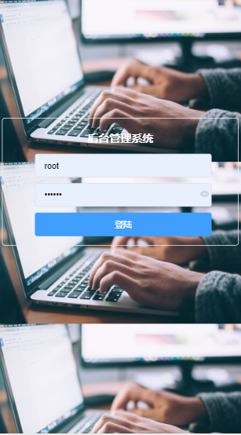
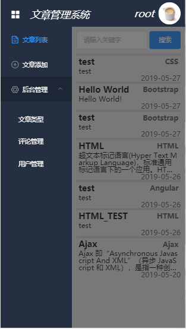
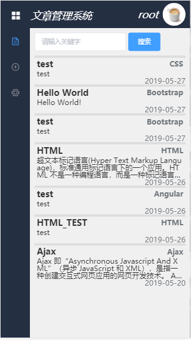
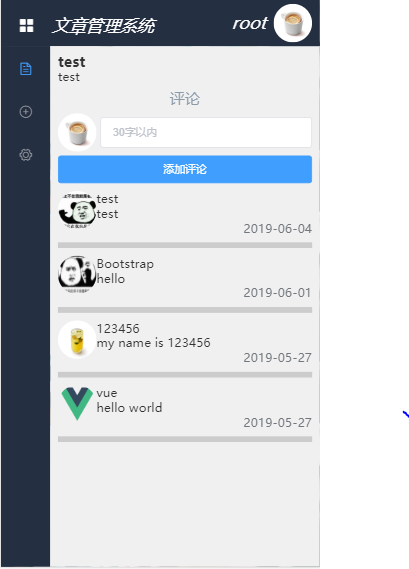
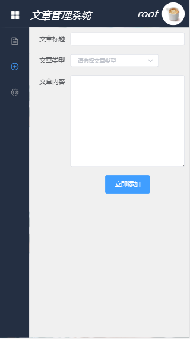
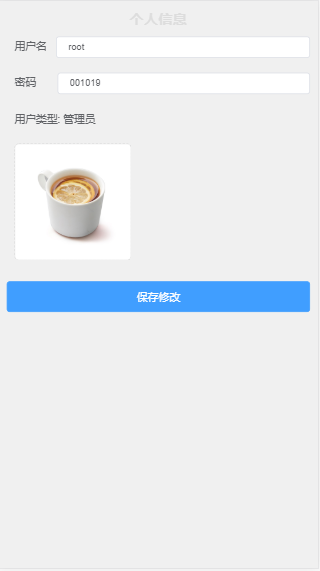
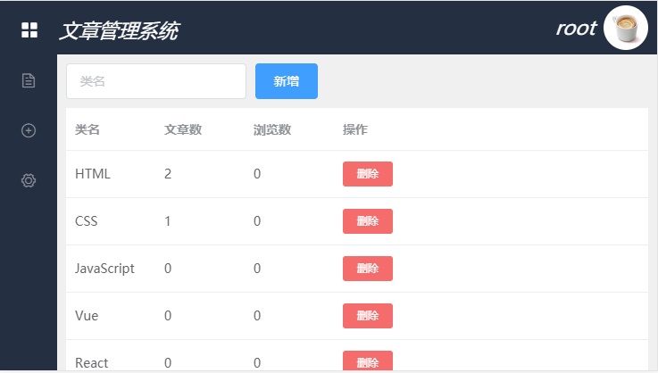
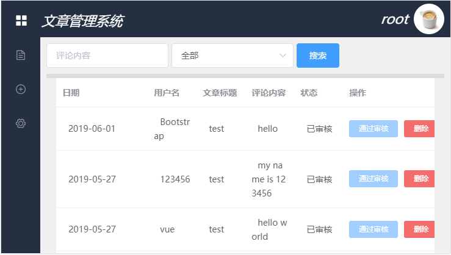
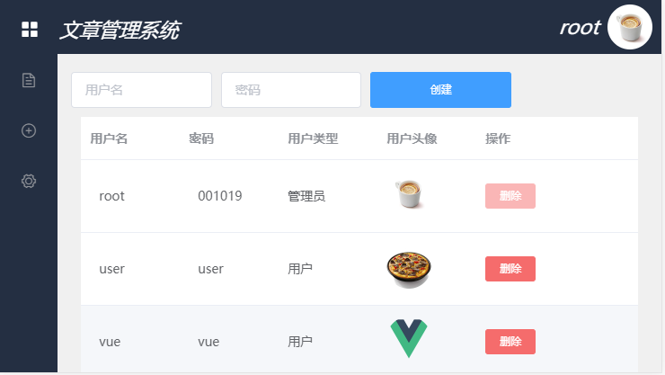

# 文章管理系统
  文章管理系统主要功能有:  
  >文章类型添加、删除  
  >文章添加、删除  
  >评论添加、审核、删除  
  >用户信息修改、头像上传、删除  
# 用户页
  
  
  
  
  
  
# 管理页
  
  
  
# 技术栈
  Vue3.0 + Vuex + Vue-router + Axios + Element-UI + PHP + MySQL
  
